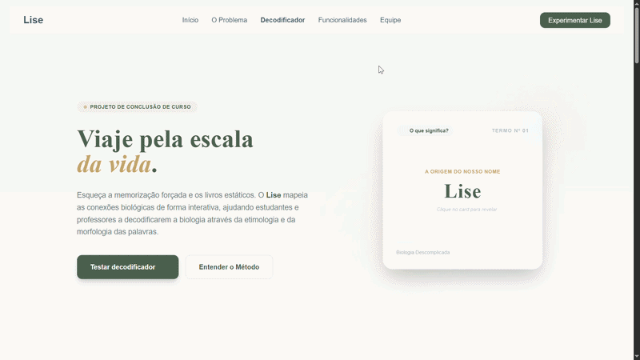

# Lise 🌿

## Descrição

Landing page da plataforma Lise e decodificador interativo para termos biológicos. O objetivo é transformar a memorização tradicional em uma experiência visual e intuitiva, ajudando estudantes a entender a origem e o significado de palavras científicas através de radicais, prefixos e sufixos.

## Demonstração

## Índice

- [Funcionalidades](#funcionalidades)
- [Tecnologias Utilizadas](#tecnologias-utilizadas)
- [Autores](#autores)
- [Licença](#licença)

## Funcionalidades

- ✅ Navegação intuitiva com menu responsivo
- ✅ Flashcard interativo 3D para explicar termos biológicos
- ✅ Decodificador de termos morfológicos com prefixos e sufixos
- ✅ Interface visual agradável com estilo inspirado em biologia e educação
- ✅ Texto explicativo para apoiar estudantes e professores

## Tecnologias Utilizadas

- **HTML** para a estrutura da página
- **CSS / Tailwind CSS** para o estilo moderno e responsivo
- **JavaScript** para a lógica interativa e animações

## Autores

- Isabelly Ferreira
- João Pedro Stadler
- John Cristopher
- Lívia Matos

## Licença

Este projeto está licenciado sob a Licença MIT - veja o arquivo `LICENSE` para mais detalhes.
